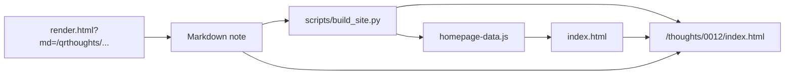

# Markdown Publishing Workflow

## Document Control

| Field | Value |
| --- | --- |
| Title | Markdown Publishing Workflow |
| Status | Implemented |
| Date | 2026-05-20 |
| Scope | Daily article authoring and generated homepage data |
| Primary Decision | Markdown files are the canonical content records; `homepage-data.js` is generated, not manually maintained |

## 1. Decision

The public article system now uses a Markdown-first workflow:

1. Add or edit a Markdown file under `qrthoughts/`.
2. Keep the file-header comment at the start of the Markdown file, followed by required front matter.
3. Run the site build script.
4. The build script scans Markdown and regenerates `homepage-data.js`.
5. The build generates clean article URLs such as `/thoughts/0012/`.
6. The homepage links each article to its clean URL.

`index-data.js` is now legacy migration input only. It should not be the day-to-day table for adding new articles.

## 2. Runtime Shape



## 3. New Note Workflow

Preferred command:

```powershell
python scripts/new_note.py Thoughts "新的标题"
```

This creates:

```text
qrthoughts/yearYYYY/monthM/[Thoughts][NNNN][新的标题].md
```

It also regenerates `homepage-data.js` and clean article pages unless `--no-build` is passed.
It also supports optional `--tags`, `--series`, `--summary`, and `--open` arguments.

Manual workflow:

```powershell
python scripts/build_site.py
```

The build fails if an older Markdown file is missing front matter. If needed:

```powershell
python scripts/build_site.py --normalize
```

## 4. Required Markdown Contract

Every public note must contain a top file-header comment when present, followed by front matter:

```markdown
<!---------------------------------------------------------
 - Author: Qirong ZHANG
 - Date: 2026-05-20 10:00:00
 - Github: https://github.com/ShepherdQR
 - LastEditors: Qirong ZHANG
 - LastEditTime: 2026-05-20 10:00:00
 - Copyright (c) 2026 Qirong ZHANG. All rights reserved.
 - SPDX-License-Identifier: LGPL-3.0-or-later.
 --------------------------------------------------------->
---
type: Thoughts
id: "0013"
title: "新的标题"
created: "2026-05-20 10:00:00"
created_date: "2026-05-20"
published: "2026-05-20"
updated: "2026-05-20 10:00:00"
updated_date: "2026-05-20"
slug: "thoughts-0013"
status: "published"
source:
  date_source:
    created: "new-note"
    published: "new-note"
    updated: "new-note"
---
```

`render.html` displays the date fields near the article title:

```text
创建：YYYY-MM-DD    发布：YYYY-MM-DD    更新：YYYY-MM-DD
```

The publication date is hidden only when it equals the creation date.

## 5. Article Template

`includes/js/article-renderer.js` is the shared article renderer used by both generated clean URL pages and `render.html`. It:

1. Fetches Markdown from either embedded `article-config` or the `md` query parameter.
2. Parses front matter.
3. Uses front matter title and dates for the header.
4. Renders Markdown with `marked`.
5. Runs MathJax after content is visible.
6. Re-activates trusted embedded scripts for migrated interactive notes.
7. Loads local `includes/js/d3.js` for the historical D3 note.

Generated clean URL pages intentionally contain only the shared article shell and a small `article-config` block.

## 6. Legacy HTML Policy

Legacy HTML article files may remain in the repository as compatibility copies, but they are no longer canonical content records. Public homepage data is generated from Markdown. New content should not be added to `index-data.js` or copied from an HTML template.

## 7. Acceptance Criteria

The workflow is acceptable when:

1. A new Markdown note can be created without touching HTML.
2. The homepage updates after one build command.
3. The clean article URL shows title, type/id, creation date, publication date when relevant, and update date.
4. Public article count comes from Markdown front matter.
5. Legacy `render.html?md=...` links still render for compatibility.
6. Legacy `index-data.js` is not required for new records.
