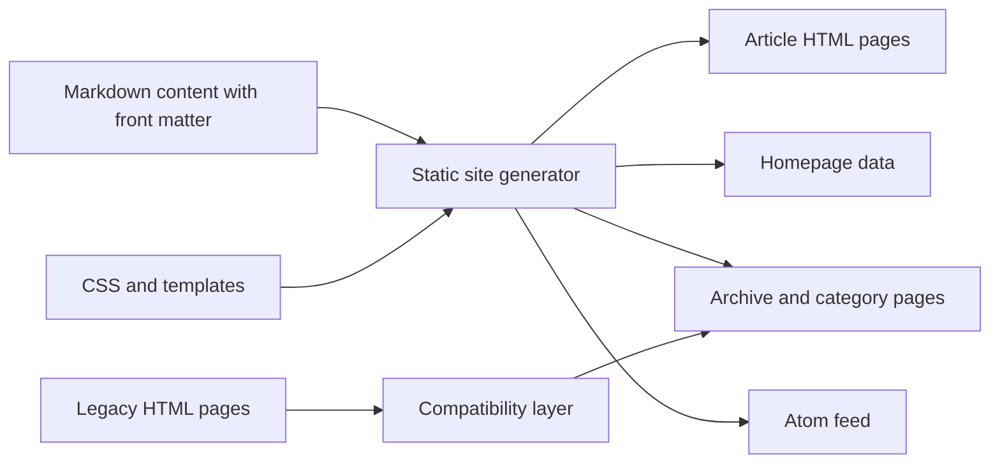

# Site Content Architecture

## Document Control

| Field | Value |
| --- | --- |
| Title | Site Content Architecture |
| Status | Proposed |
| Date | 2026-05-19 |
| Scope | ShepherdQR.github.io static personal site |
| Primary Decision | Use Markdown as the content source and generate static HTML as the public delivery format |

## 1. Executive Decision

The site should not standardize on the current runtime pattern `render.html?md=...` as the final architecture.

The recommended architecture is:

1. Markdown is the single source of truth for article content.
2. Each Markdown article contains explicit metadata in front matter.
3. Static HTML pages are generated before deployment.
4. Public URLs are stable, short, and independent of Chinese filenames and bracket-heavy source filenames.
5. The homepage becomes a compact knowledge map inspired by mathematician and physicist personal homepages, while the full reverse chronological list moves into archive/category pages.

This preserves the current minimalist style while improving maintainability, searchability, link stability, and long-term durability.

## 2. Current Architecture

### 2.1 Repository Structure

Current major site components:

| Path | Role |
| --- | --- |
| `index.html` | Homepage shell; renders list items from `index-data.js` |
| `index-data.js` | Manually maintained homepage data |
| `render.html` | Runtime Markdown renderer using `fetch`, `marked`, and MathJax |
| `includes/css/frontpage.css` | Homepage style |
| `includes/css/pages.css` | Article page style |
| `includes/js/header.js` | Shared utility functions for older HTML pages |
| `qrthoughts/` | Main content tree, organized by year and month |
| `usedTemplate/` | Historical templates |

### 2.2 Content Generations

The repository currently contains multiple content formats:

| Generation | Format | Description |
| --- | --- | --- |
| Legacy HTML | `.html` | Full article pages with repeated HTML template and inline content |
| HTML with embedded script content | `.html` | Content is written through JavaScript helpers such as `writeString` |
| Markdown rendered at runtime | `.md` + `render.html?md=...` | Newer articles are rendered in the browser |
| Transitional Markdown split template | `.html` + co-located `.md` | Experimental pattern in `usedTemplate/` and some content |

Observed scale:

| Type | Approximate Count |
| --- | --- |
| Markdown files under `qrthoughts/` | 17 |
| HTML files under `qrthoughts/` | 127 |

The site is therefore not yet structurally unified.

## 3. Problems

### 3.1 Content Maintainability

Legacy HTML requires repeated boilerplate and mixes content with presentation. Some pages use JavaScript string blocks for prose, which makes editing, diffing, search, and migration harder.

### 3.2 Metadata Duplication

Article type, id, title, date, and status are mostly inferred from filenames or comments. This makes it difficult to reliably generate homepage lists, archives, feeds, and category pages.

### 3.3 Runtime Rendering Risk

The current Markdown renderer depends on browser-side JavaScript and external CDN scripts. If JavaScript is disabled, network loading fails, or the Markdown parser changes behavior, content delivery can degrade.

### 3.4 URL Stability

URLs such as `render.html?md=/qrthoughts/year2026/month5/[Thoughts][0008][政绩观]` expose implementation details. They also contain characters that require careful URL encoding, especially Chinese characters, quotes, and brackets.

### 3.5 Search and Sharing

Runtime-rendered articles share the same base document, `render.html`. This is weaker for search engines, previews, browser history, and direct article identity than dedicated static HTML URLs.

### 3.6 Homepage Information Architecture

The current homepage is primarily a reverse chronological list. This is useful as an archive, but it does not explain the site identity, major collections, or durable entry points.

### 3.7 Feed Integrity

The current `includes/atom.xml` should be treated as suspect because it appears to contain a GitHub Pages 404 response rather than a valid feed. Feed generation should be rebuilt from canonical metadata.

## 4. Goals

### 4.1 Functional Goals

| ID | Requirement |
| --- | --- |
| F1 | New articles can be written as Markdown without copying HTML boilerplate |
| F2 | Article metadata is machine-readable and validated |
| F3 | Homepage, archives, category pages, and feeds are generated from the same metadata source |
| F4 | Article pages are available as static HTML |
| F5 | Legacy article links remain accessible during migration |
| F6 | MathJax remains available for mathematical content |
| F7 | The homepage provides a concise site identity and durable navigation |

### 4.2 Non-Functional Goals

| ID | Requirement |
| --- | --- |
| N1 | Minimal frontend complexity |
| N2 | No runtime framework dependency |
| N3 | Stable URLs suitable for long-term linking |
| N4 | Source files remain human-readable |
| N5 | Generated files are deterministic |
| N6 | The visual style remains minimalist, text-first, and scholarly |
| N7 | The site remains compatible with GitHub Pages static hosting |

## 5. Non-Goals

The following are intentionally out of scope for the first architecture upgrade:

1. Building a full single-page application.
2. Introducing a database or server-side runtime.
3. Redesigning the site into a marketing-style homepage.
4. Migrating all legacy HTML articles in one step.
5. Rewriting all article prose or normalizing all historical content manually.

## 6. Proposed Target Architecture

### 6.1 Architecture Summary



### 6.2 Content Source

Markdown files remain under `qrthoughts/` or a future `content/` directory. The current year/month organization can be preserved for source management.

Recommended source file naming remains compatible with the current convention:

```text
qrthoughts/year2026/month5/[Thoughts][0008][政绩观].md
```

This filename is acceptable as an authoring artifact, but it should not define the final public URL.

### 6.3 Required Front Matter

Every new Markdown article should include front matter:

```yaml
---
type: Thoughts
id: "0008"
title: "政绩观"
date: "2026-05-02"
updated: "2026-05-16"
slug: "zhengjiguan"
status: "published"
---
```

Required fields:

| Field | Type | Required | Description |
| --- | --- | --- | --- |
| `type` | enum | Yes | `Books`, `Thoughts`, `Study`, `Videos`, or future approved type |
| `id` | string | Yes | Four-digit content id within its type |
| `title` | string | Yes | Human-readable title |
| `date` | date | Yes | First publication or canonical article date |
| `updated` | date | No | Last meaningful content update |
| `slug` | string | Yes | Stable ASCII public URL segment |
| `status` | enum | Yes | `draft`, `published`, `doing`, or `archived` |

Optional fields:

| Field | Type | Description |
| --- | --- | --- |
| `subtitle` | string | Secondary title |
| `summary` | string | Short homepage/archive excerpt |
| `tags` | array | Subject tags |
| `series` | string | Series name |
| `legacy_url` | string | Existing URL to preserve |
| `math` | boolean | Whether MathJax should be loaded |

### 6.4 Public URL Strategy

Recommended public URLs:

```text
/thoughts/0008/
/books/0122/
/study/0001/
/videos/0002/
```

Alternative slug-inclusive URLs:

```text
/thoughts/0008-zhengjiguan/
/books/0122-luxun/
```

Decision:

Use id-based URLs for maximum stability. Keep slugs in metadata for generated page titles, aliases, search, and future optional redirects.

### 6.5 Generated Outputs

The build process should generate:

| Output | Source |
| --- | --- |
| Article HTML pages | Markdown content + article template |
| Homepage data or homepage HTML | Metadata sorted by date and curated fields |
| Category pages | `type` field |
| Year archive pages | `date` field |
| Atom feed | Published articles only |
| Link integrity report | Generated and legacy URLs |

### 6.6 Homepage Architecture

The homepage should follow the durable personal homepage pattern seen in many mathematician and physicist sites:

1. Site title and short identity statement.
2. A small `What's New` section.
3. Durable collection links.
4. Selected long notes or current projects.
5. Archive navigation.
6. Minimal external links.

Recommended homepage skeleton:

```text
Pursuing Immortality
Qirong Zhang

Software, algorithms, reading notes, poems, and scattered attempts at durable thought.

What's New
2026-05-12  对“生存还是毁灭”这一问题的认识
2026-05-05  “十五五”规划引领软件创新
2026-05-02  政绩观

Collections
Thoughts    Books    Study    Videos

Long Notes
鲁迅
Turing Award
BooksDoneIndex
BooksItem

Archive
2026 / 2025 / 2024 / 2023 / ...
```

The full reverse chronological list should become an archive page rather than the entire homepage.

### 6.7 Styling Principles

The site should remain:

1. Text-first.
2. Low ornament.
3. High contrast.
4. Fast to load.
5. Readable on desktop and mobile.
6. Close to the existing `pages.css` and `frontpage.css` spirit.

Avoid:

1. Card-heavy marketing layout.
2. Large decorative hero sections.
3. Framework-specific UI dependencies.
4. Image-driven visual identity unless an article specifically needs images.

## 7. Options Considered

### Option A: Keep Current Runtime Markdown Renderer

Description:

Continue using `render.html?md=...` for all new and migrated Markdown pages.

Advantages:

1. Very small immediate change.
2. Easy to author Markdown.
3. Reuses current `render.html`.

Disadvantages:

1. Weak public URLs.
2. Runtime dependency on JavaScript and CDN parser.
3. Poor no-JavaScript fallback.
4. Harder search and preview behavior.
5. Metadata remains external or implicit.

Decision:

Rejected as the final architecture. It can remain as a transitional compatibility mechanism.

### Option B: Co-Located HTML Shim and Markdown File

Description:

Each article has one `.html` wrapper and one `.md` content file in the same directory.

Advantages:

1. Cleaner URLs than `render.html?md=...`.
2. Easier incremental migration than full static generation.
3. Preserves per-article HTML identity.

Disadvantages:

1. Still renders at runtime.
2. Still duplicates wrapper files.
3. Still depends on browser-side Markdown parsing.

Decision:

Acceptable as a short-term bridge, not the long-term target.

### Option C: Static Generation from Markdown

Description:

Markdown is transformed into static HTML at build time.

Advantages:

1. Best long-term maintainability.
2. Stable URLs.
3. Better search and sharing.
4. Deterministic generated outputs.
5. Shared metadata can generate homepage, archives, and feeds.
6. Minimal runtime JavaScript.

Disadvantages:

1. Requires a small build step.
2. Requires migration tooling.
3. Requires metadata cleanup.

Decision:

Accepted as the target architecture.

### Option D: Full Framework Migration

Description:

Move to a modern frontend framework or large static site framework.

Advantages:

1. Rich component model.
2. Many existing plugins.

Disadvantages:

1. More complexity than the site needs.
2. Higher dependency burden.
3. Risks damaging the existing minimalist style.

Decision:

Rejected for now.

## 8. Migration Strategy

### Phase 0: Architecture Baseline

1. Maintain this architecture folder.
2. Treat this document as the baseline decision record.
3. Do not bulk-migrate content until metadata and URL rules are accepted.

### Phase 1: New Content Standard

1. All new articles use Markdown.
2. All new Markdown files include required front matter.
3. The current filename convention may continue for source files.
4. `index-data.js` is not manually expanded after generation tooling exists.

### Phase 2: Generator Prototype

Build a small generator that:

1. Reads Markdown files.
2. Parses front matter.
3. Validates required fields.
4. Generates static article HTML.
5. Generates homepage/archive data.
6. Generates a valid Atom feed.

The generator can be implemented with a lightweight Node.js or Python script. Avoid a large framework unless later requirements justify it.

### Phase 3: Homepage Upgrade

1. Replace the homepage long list with the knowledge-map structure.
2. Keep a link to the full archive.
3. Generate `What's New` from published metadata.
4. Keep visual style minimal and scholarly.

### Phase 4: Incremental Legacy Migration

Migration order:

1. Current and recent Markdown pages.
2. High-value pages linked from homepage.
3. Books index pages.
4. Frequently referenced legacy HTML pages.
5. Remaining historical pages as time allows.

Legacy pages should remain accessible until replacements are verified.

### Phase 5: Cleanup

1. Remove obsolete templates only after no generated or legacy page depends on them.
2. Replace broken or stale feeds.
3. Normalize old links where safe.
4. Preserve redirects or compatibility links where practical.

## 9. Validation Rules

### 9.1 Metadata Validation

The build should fail if:

1. Required front matter is missing.
2. `type` is not an approved value.
3. `id` is not unique within a type.
4. `date` is invalid.
5. `slug` contains unsafe URL characters.
6. A published article has no title.

### 9.2 Link Validation

The build should report:

1. Missing local links.
2. Missing images.
3. Legacy URLs without replacements.
4. Homepage links that do not resolve.

### 9.3 Render Validation

At minimum, verify:

1. Homepage renders.
2. One `Thoughts` article renders.
3. One `Books` article renders.
4. One article with code block renders.
5. One article with MathJax renders.
6. Mobile layout remains readable.

## 10. Risks and Mitigations

| Risk | Impact | Mitigation |
| --- | --- | --- |
| Bulk migration breaks historical links | High | Migrate incrementally and preserve legacy URLs |
| Metadata cleanup takes longer than expected | Medium | Require metadata only for new and migrated pages |
| Generated output adds noise to git diffs | Medium | Keep generator deterministic and separate source from output |
| Chinese filenames complicate URLs | Medium | Keep Chinese source filenames but use ASCII public slugs or id-based URLs |
| Minimalist design becomes over-designed | Medium | Keep homepage text-first and avoid component-heavy UI |
| Runtime Markdown pages remain indefinitely | Low | Treat `render.html` as transitional after generator exists |

## 11. Acceptance Criteria

The architecture upgrade is considered successful when:

1. New articles can be added as Markdown with front matter.
2. Static article HTML can be generated from Markdown.
3. Homepage entries are generated or derived from metadata.
4. A valid feed is generated from published content.
5. Existing legacy pages remain reachable.
6. Public URLs no longer require `render.html?md=...` for newly generated pages.
7. The homepage presents identity, recent updates, collections, selected notes, and archive links.

## 12. Final Recommendation

Adopt static generation from Markdown as the target architecture.

Keep the current `render.html?md=...` approach only as a transitional tool. Preserve the current filename convention for authoring if desired, but move canonical metadata into front matter and expose clean generated URLs to readers.

The homepage should evolve from a single chronological list into a compact scholarly knowledge map. This aligns with the durable personal homepage tradition while retaining the site's existing minimalist identity.

