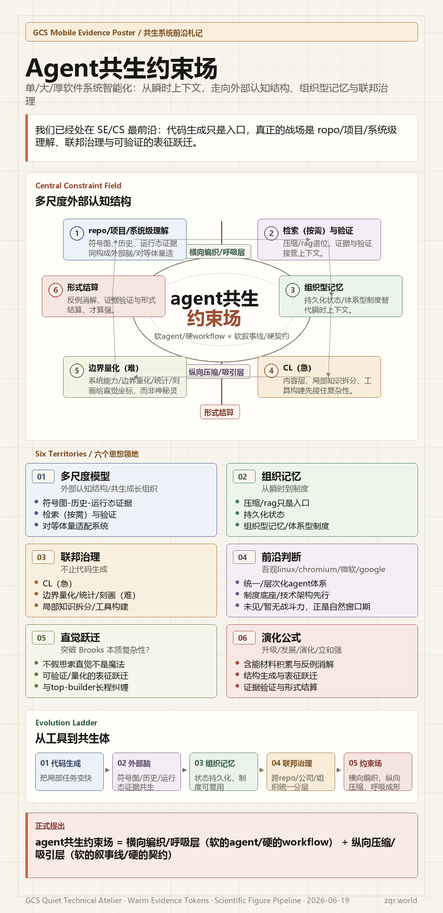

<!---------------------------------------------------------
 - Author: Qirong ZHANG
 - Date: 2026-06-19 10:13:35
 - Github: https://github.com/ShepherdQR
 - LastEditors: Qirong ZHANG
 - LastEditTime: 2026-06-19 10:40:23
 - Copyright (c) 2026 Qirong ZHANG. All rights reserved.
 - SPDX-License-Identifier: LGPL-3.0-or-later.
 --------------------------------------------------------->
---
type: Thoughts
id: "0018"
title: "agent共生约束场"
created: "2026-06-19 10:13:35"
created_date: "2026-06-19"
published: "2026-06-19"
updated: "2026-06-19 10:40:23"
updated_date: "2026-06-19"
slug: "agent"
status: "published"
source:
  date_source:
    created: "new-note"
    published: "new-note"
    updated: "new-note"
---

# agent共生约束场

# 关于单/大/厚软件系统智能化：
- 多尺度模型：ropo/项目/系统级理解核心是构建符号图-历史-运行态证据-检索（按需）与验证的多维度/多层次/多分辨率的外部认知结构/共生成长组织/对等体量适配系统
- 组织记忆：瞬时上下文（压缩/rag）需要转向持久化状态/组织型记忆/体系型制度；
- 联邦治理：除了代码生成，还有很丰富的内容：CL（急），系统能力/边界量化/统计/刻画（难），局部知识拆分/工具构建

# 我们已经处在SE/CS最前沿：
- 在跨reop/公司级/组织级的统一/层次化agent体系构建方面，吾观linux内核/chromium/微软/google正在谋划/探索阶段，且制度底座/技术架构先行趋势明显，但未见/暂无战斗力
- agent共生是17号晚上在内部写文档临时起意想到的词，很好描绘我们即将已经到来的境况，且一搜索果然有好多相关讨论。说明一旦有实践场域自然可以与top-builder形成长程纠缠（例如我们的课题/项目/组织/开发者），我们不禁好奇，是否【不假思索直觉】是突破brooks本质复杂性的根本？不是，技术层面解构【直觉】只是可验证/量化的表征跃迁
- 升级/发展/演化/立和强 = 含能材料积累与反例消解 + 结构生成与表征跃迁 +  证据验证与形式结算
- 自然地把约束场/共生/叙事线/呼吸等统合起来，我们正式提出agent共生约束场 = 横向编织/呼吸层（软的agent/硬的workflow） + 纵向压缩/吸引层（软的叙事线/硬的契约）
