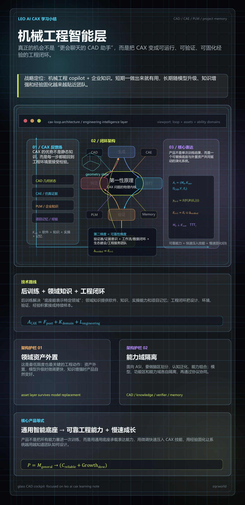

<!---------------------------------------------------------
 - Author: Qirong ZHANG
 - Date: 2026-06-24 23:00:41
 - Github: https://github.com/ShepherdQR
 - LastEditors: Qirong ZHANG
 - LastEditTime: 2026-06-24 23:01:59
 - Copyright (c) 2026 Qirong ZHANG. All rights reserved.
 - SPDX-License-Identifier: LGPL-3.0-or-later.
 --------------------------------------------------------->
---
type: Thoughts
id: "0019"
title: "机械工程智能层"
created: "2026-06-24 23:00:41"
created_date: "2026-06-24"
published: "2026-06-24"
updated: "2026-06-24 23:00:41"
updated_date: "2026-06-24"
slug: "thoughts-0019"
status: "published"
summary: "以 CAX 领域的可反馈闭环为场景，提出由通用智能底座、外置领域资产、后训练、企业知识和工程验证共同构成机械工程智能层。"
tags: ["ASI", "agent", "software-engineering", "evaluation"]
series: "Agentic Software Engineering"
source:
  date_source:
    created: "new-note"
    published: "new-note"
    updated: "new-note"
---

# 机械工程智能层

# leo ai cax学习小结
- 仔细想来，整个cax领域有较强的反馈环境，还是比较适合构建闭环的：生成-运行-验证-纠正-固化
- 内核是第一性原理；第二梯度是验证器_证据意识，工作流_数据闭环，生态建设_工程服务团队; 后面是专业的数据/后训练技术/agent
- leo ai 这个公司的战略定位是机械工程智能层：机械工程copilot + 企业知识
- 这个产品：一做出来就有用，基础模型升级时引导微调也快，随知识增强也会越来越好用。但是，究竟还是感觉是整个思路需要调整到基础模型完全分离，强化TTT
- 技术路线：没有问题，此时最优技术路线: 后训练（底座模型能够表示特定领域） + 领域知识（应用软件+知识+实操能力+项目记忆） + 工程闭环（设计-工程环境-经验积累）
- 再不济，至少要尽快保证【领域资产外置】
- 进一步地，asi一定要做脑区划分/认知泛化/能力组合，模型和不同功能区/能力域要隔离
- 核心思想：产品 = 通用智能底座模型 --> （可靠的cax工程能力【微调来快速压入技能】 + 能够越用越好用【慢速经验固化与成长】）
