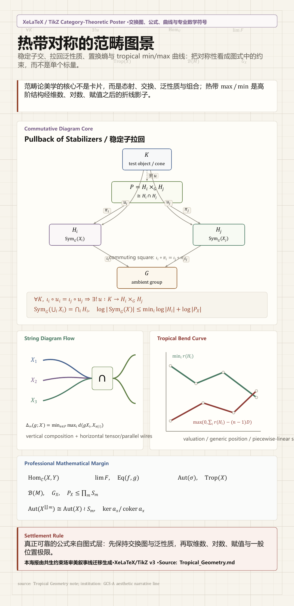

<!---------------------------------------------------------
 - Author: Qirong ZHANG
 - Date: 2026-06-24 23:09:19
 - Github: https://github.com/ShepherdQR
 - LastEditors: Qirong ZHANG
 - LastEditTime: 2026-06-24 23:09:39
 - Copyright (c) 2026 Qirong ZHANG. All rights reserved.
 - SPDX-License-Identifier: LGPL-3.0-or-later.
 --------------------------------------------------------->
---
type: Thoughts
id: "0020"
title: "热带对称的范畴图景"
created: "2026-06-24 23:09:19"
created_date: "2026-06-24"
published: "2026-06-24"
updated: "2026-06-24 23:09:19"
updated_date: "2026-06-24"
slug: "thoughts-0020"
status: "published"
source:
  date_source:
    created: "new-note"
    published: "new-note"
    updated: "new-note"
---

# 热带对称的范畴图景

是这样的，这是把共生约束场抽象成【独立repo】节点，发挥吸收/富集/统合效能的初探小捷。研究转向repo群的结构，是一种联邦治理/项目集管理/生态建设/文明运营行为

