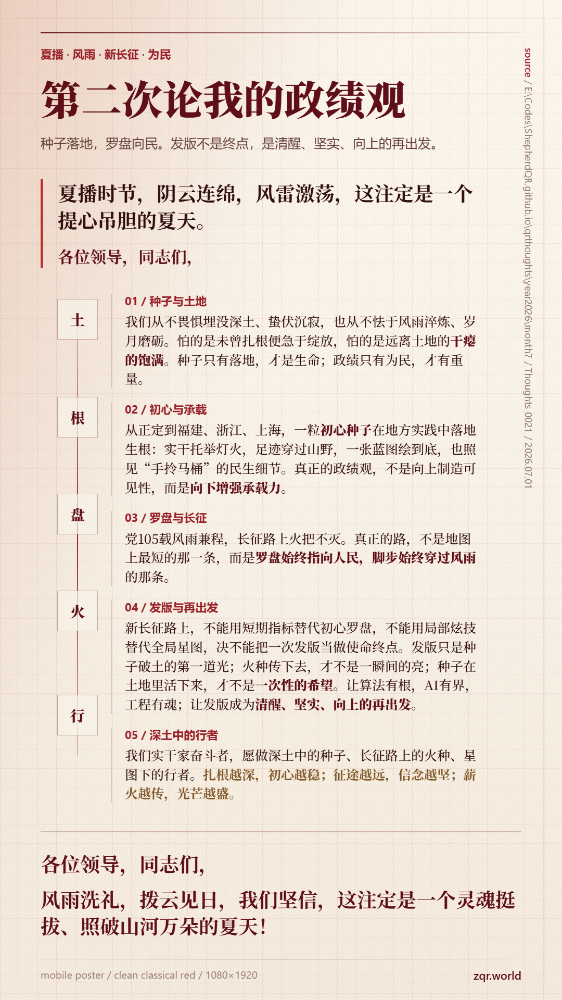

<!---------------------------------------------------------
 - Author: Qirong ZHANG
 - Date: 2026-07-01 21:53:32
 - Github: https://github.com/ShepherdQR
 - LastEditors: Qirong ZHANG
 - LastEditTime: 2026-07-01 22:38:08
 - Copyright (c) 2026 Qirong ZHANG. All rights reserved.
 - SPDX-License-Identifier: LGPL-3.0-or-later.
 --------------------------------------------------------->
---
type: Thoughts
id: "0021"
title: "第二次论我的政绩观"
created: "2026-07-01 21:53:32"
created_date: "2026-07-01"
published: "2026-07-01"
updated: "2026-07-01 21:53:32"
updated_date: "2026-07-01"
slug: "thoughts-0021"
status: "published"
source:
  date_source:
    created: "new-note"
    published: "new-note"
    updated: "new-note"
---

# 第二次论我的政绩观

夏播时节，阴云连绵，风雷激荡，这注定是一个提心吊胆的夏天。
---

各位领导，同志们，

我们从不畏惧埋没深土，蛰伏沉寂；而是担心未曾扎根固本，便急于抽枝绽放。

我们从不怯于风雨淬炼，岁月磨砺；而是担心远离土地的干瘪的饱满。

种子只有落地，才是生命；政绩只有为民，才有重量。

越是在这样的夏天，越能体现一粒种子的初心。

---

回顾总书记深耕地方，砥砺实干的奋斗历程，正是这样一粒初心种子落地生根的壮阔长征:

- 在正定，摒弃浮华虚名，以实干托举万家灯火；
- 在福建，三进下党，四下基层，初心足迹遍布山野阡陌；
- 在浙江，一张蓝图绘到底，让万千乡村各美其美；
- 在上海，紧盯“手拎马桶”这样的民生细节，细微处见初心，点滴处显担当。

真正的政绩观，从来不是向上制造可见性，而是向下增强承载力。

---

党105载风雨兼程，长征路上火把不灭。
---

真正的路，从来不是地图上最短的那一条，而是罗盘始终指向人民，脚步始终穿过风雨的那条。

我们正阔步在独立自主的新长征之路，要常怀警醒，坚守本心:
- 绝不能用短期指标替代初心罗盘，
- 绝不能用局部炫技替代全局星图，
- 决不能把一次发版当做使命终点。

发版只是种子破土的第一道光，是新起点/新征程/新攻坚，更要扎根用户反馈土壤，直面真实场景风雨，护航系统生态演化。

火种只有沿着长征路传下去，才不是一瞬间的亮；

种子只有在土地里活下来，才不是一次性的希望。

---

新的战场，新的赶考，任何时候，
- 都不能让目标函数偏离人民，
- 不能让评价体系绑架初心，
- 不能让局部最优遮蔽全局使命。

要让算法有根，AI有界，工程有魂；

让发版，作为新长征路上清醒、坚实、向上的再出发。

我们实干家奋斗者，愿做深土中的种子、长征路上的火种、星图下的行者。
- 扎根越深，初心越稳
- 征途越远，信念越坚
- 薪火越传，光芒越盛

---

各位领导，同志们，

风雨洗礼，拨云见日，我们坚信，这注定是一个灵魂挺拔、照破山河万朵的夏天！
---

谢谢。

# // 写在后面

- 20260630凌晨写完初稿，在20260630中午大改，话题较难统合: 首先要突出总书记的地方工作实践；其次在意象上需要协调多雨的夏与发版任务/种子与土地/党与长征。
- 整体很弱，结构很不完善，后续需要持续打磨优化。
- 这个是原稿，在20260630下午4点的集中研讨中报告，初始规划3分钟以内，演练5次左右，根据节奏估计大约3'20。

