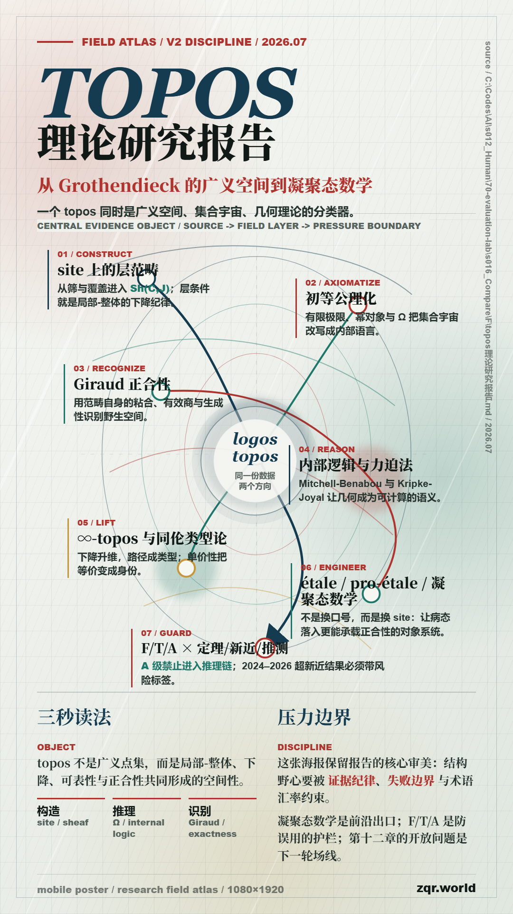

<!---------------------------------------------------------
 - Author: Qirong ZHANG
 - Date: 2026-07-03 00:49:05
 - Github: https://github.com/ShepherdQR
 - LastEditors: Qirong ZHANG
 - LastEditTime: 2026-07-03 00:49:50
 - Copyright (c) 2026 Qirong ZHANG. All rights reserved.
 - SPDX-License-Identifier: LGPL-3.0-or-later.
 --------------------------------------------------------->
---
type: Thoughts
id: "0022"
title: "Topos理论研究报告"
created: "2026-07-03 00:49:05"
created_date: "2026-07-03"
published: "2026-07-03"
updated: "2026-07-03 00:49:05"
updated_date: "2026-07-03"
slug: "topos"
status: "published"
source:
  date_source:
    created: "new-note"
    published: "new-note"
    updated: "new-note"
---

# Topos理论研究报告

