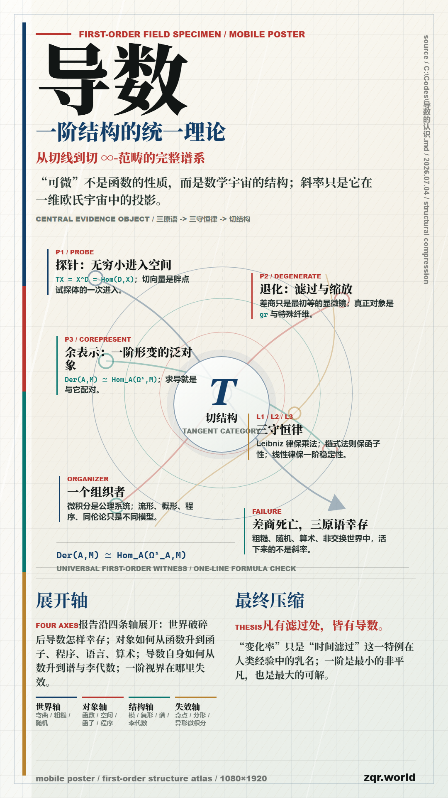
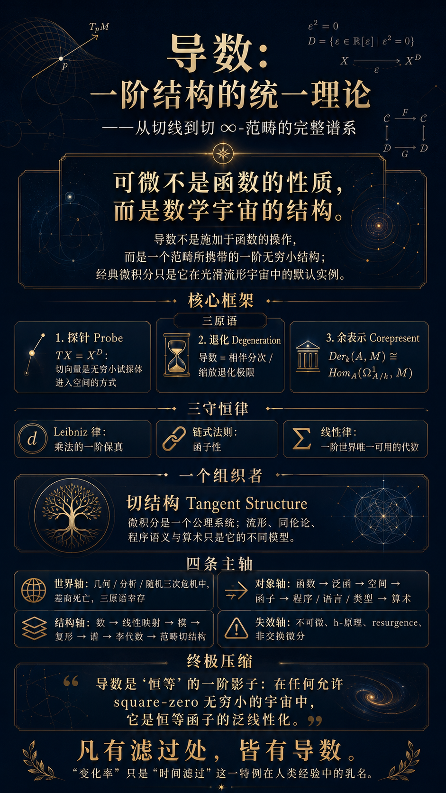

<!---------------------------------------------------------
 - Author: Qirong ZHANG
 - Date: 2026-07-04 18:39:13
 - Github: https://github.com/ShepherdQR
 - LastEditors: Qirong ZHANG
 - LastEditTime: 2026-07-04 18:43:25
 - Copyright (c) 2026 Qirong ZHANG. All rights reserved.
 - SPDX-License-Identifier: LGPL-3.0-or-later.
 --------------------------------------------------------->
---
type: Thoughts
id: "0025"
title: "Fable5和GPT5.5的图片生成质量比较"
created: "2026-07-04 18:39:13"
created_date: "2026-07-04"
published: "2026-07-04"
updated: "2026-07-04 18:39:13"
updated_date: "2026-07-04"
slug: "fable5gpt5-5"
status: "published"
source:
  date_source:
    created: "new-note"
    published: "new-note"
    updated: "new-note"
---

# Fable5和GPT5.5的图片生成效果比较

## 以下为审美叙事线驱动

## 以下为GPT5.5Pro网页版

## 以下为Fable5Max网页版

