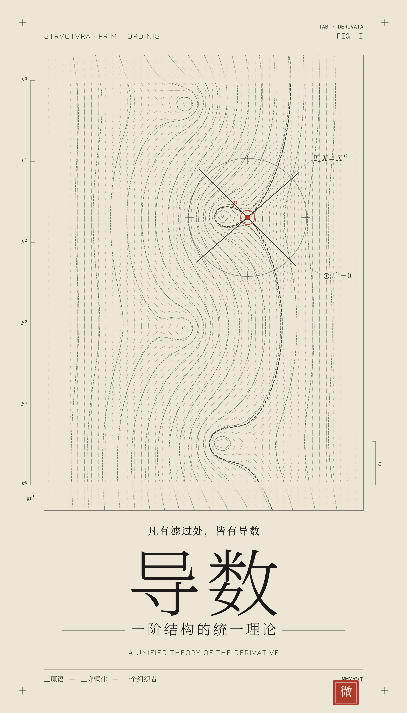

<!---------------------------------------------------------
 - Author: Qirong ZHANG
 - Date: 2026-07-04 21:00:38
 - Github: https://github.com/ShepherdQR
 - LastEditors: Qirong ZHANG
 - LastEditTime: 2026-07-04 21:05:01
 - Copyright (c) 2026 Qirong ZHANG. All rights reserved.
 - SPDX-License-Identifier: LGPL-3.0-or-later.
 --------------------------------------------------------->
---
type: Thoughts
id: "0026"
title: "导数-渐进的静默"
created: "2026-07-04 21:00:38"
created_date: "2026-07-04"
published: "2026-07-04"
updated: "2026-07-04 21:00:38"
updated_date: "2026-07-04"
slug: "thoughts-0026"
status: "published"
summary: "以“渐进的静默”视觉叙事呈现导数作为局部变化率与一阶结构的统一认识，记录数学概念的海报化表达。"
tags: ["mathematics"]
series: "数学结构札记"
source:
  date_source:
    created: "new-note"
    published: "new-note"
    updated: "new-note"
---

# 导数-渐进的静默

说明： 基于【渐进的静默】设计风格，opus4.8生成

