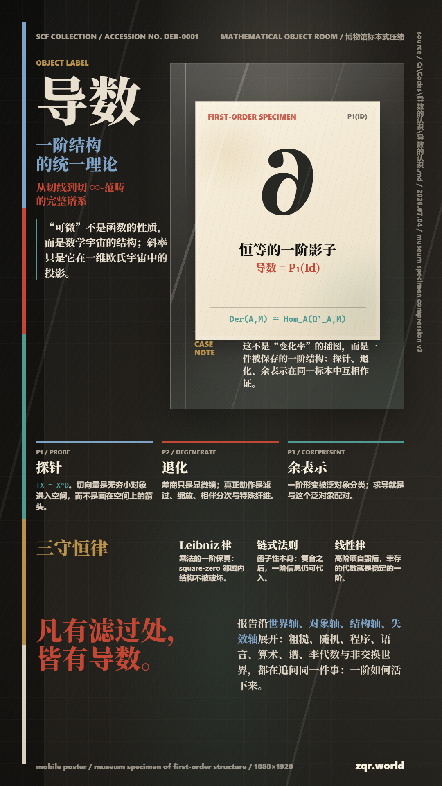

<!---------------------------------------------------------
 - Author: Qirong ZHANG
 - Date: 2026-07-04 21:03:31
 - Github: https://github.com/ShepherdQR
 - LastEditors: Qirong ZHANG
 - LastEditTime: 2026-07-04 21:03:58
 - Copyright (c) 2026 Qirong ZHANG. All rights reserved.
 - SPDX-License-Identifier: LGPL-3.0-or-later.
 --------------------------------------------------------->
---
type: Thoughts
id: "0027"
title: "导数-博物馆标本式压缩"
created: "2026-07-04 21:03:31"
created_date: "2026-07-04"
published: "2026-07-04"
updated: "2026-07-04 21:03:31"
updated_date: "2026-07-04"
slug: "thoughts-0027"
status: "published"
source:
  date_source:
    created: "new-note"
    published: "new-note"
    updated: "new-note"
---

# 导数-博物馆标本式压缩

说明：最新的审美叙事线驱动

